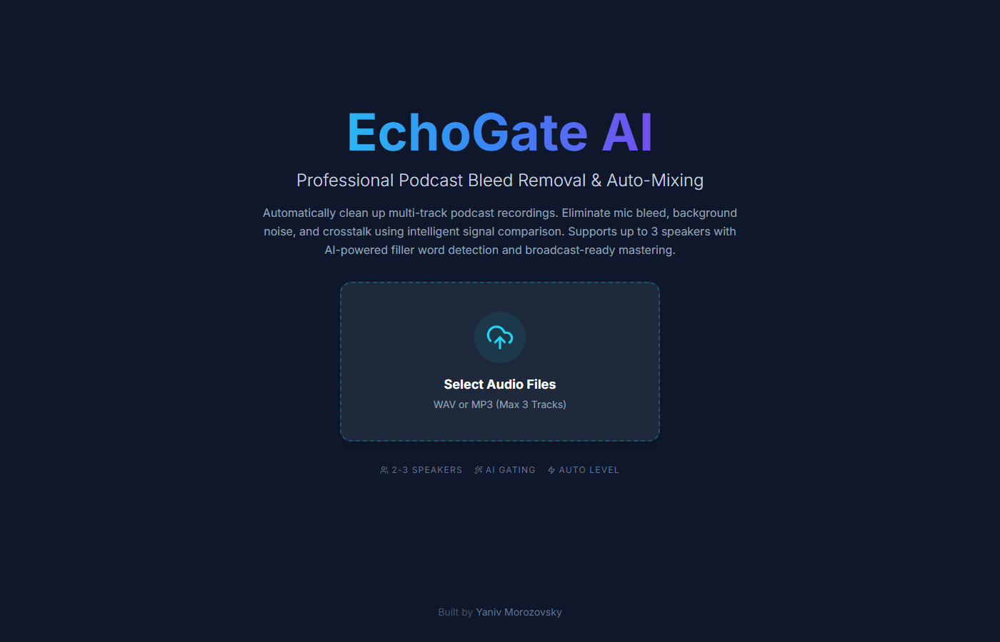
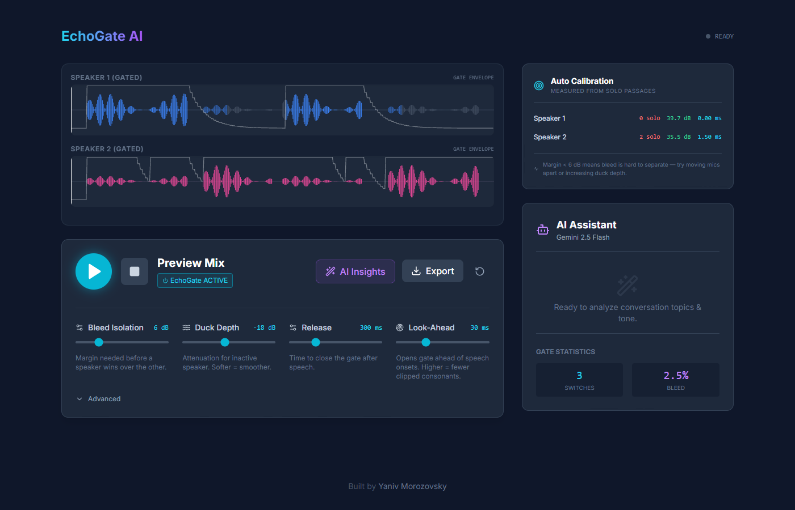
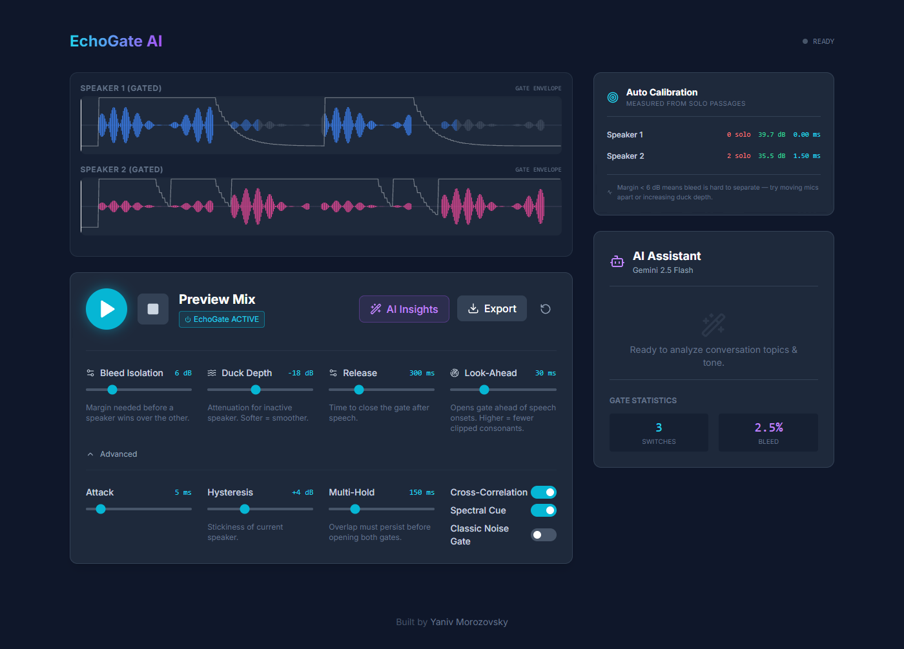
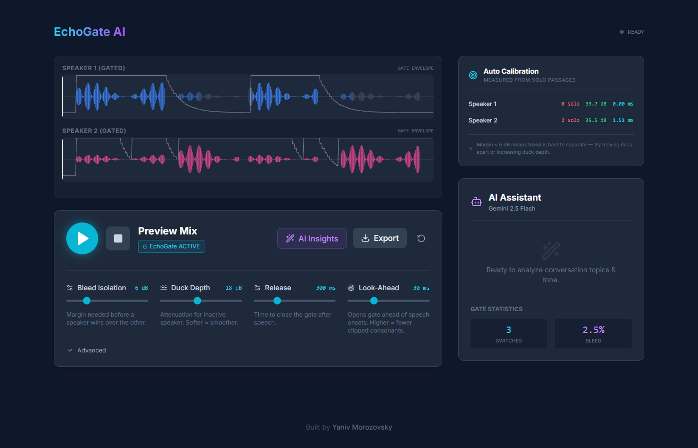

# EchoGate AI

**A free, browser-based bleed remover for podcasters.**

Two speakers sitting close with off-mic placement? Each mic hears both voices,
and a plain volume-gate gets it wrong every time. EchoGate decides who is
*actually* talking using three independent signals in parallel, then ducks the
other mic smoothly — no clicks, no clipped consonants, no mix-down needed.

**🎧 Try it live — [echogate.yaniv.tv](https://echogate.yaniv.tv)** — 100%
client-side, nothing leaves your browser.



---

## How it works

For every 50 ms frame, three cues run side by side:

1. **Cross-correlation (time-of-arrival)** — the mic with the leading signal is
   the *source*, regardless of bleed level. Speakers ~50 cm apart produce ~1–2 ms
   lag; EchoGate scans ±5 ms per block and scores the leader.
2. **Spectral presence (HF/LF ratio)** — a direct mic keeps high-frequency
   detail; bleed is naturally LP-filtered by distance and off-axis rolloff.
   The brighter channel wins a bonus.
3. **Soft ducking + look-ahead** — the inactive speaker is attenuated by a
   configurable amount (default −18 dB) instead of hard-muted, and gates open
   30 ms *before* speech onsets so consonants aren't clipped.

Every file is **auto-calibrated** on load: EchoGate scans for solo passages,
measures the real bleed ratio and inter-mic delay, and feeds those numbers
back into the decision. You can see them in the Auto Calibration sidebar.



Every waveform shows the gate envelope on top plus bar-by-bar colouring —
full colour = open, dim = ducked. You can *see* where the gate fires.

## Features

- **Up to 3 speakers**, or a single stereo file that auto-splits (L = Speaker 1, R = Speaker 2)
- **Cross-correlation, spectral cue and classic noise-gate** — each toggleable
- **Soft ducking** slider (0 dB = hard mute, up to 40 dB)
- **Look-ahead** to preserve speech onsets
- **Attack / Release / Multi-hold / Hysteresis** fine-tuning
- **Web Worker DSP** — UI stays responsive even on long files
- **Broadcast-ready export**: Enhance (HP + presence + compression) and
  Auto-Level to −16 LUFS, with an optional hard limiter
- **Individual speaker exports** (raw gated or fully processed)
- **Gemini filler-word detection** — WAV cue markers embedded in the output
- **Stereo-aware** channel averaging for mono analysis



### Stereo-file mode

Drop one 2-channel WAV/MP3 and EchoGate treats Left as Speaker 1 and Right as
Speaker 2 — perfect for Zoom, Riverside or any single-device recording.



## Tech stack

- React 18 + TypeScript + Vite
- Web Audio API (`OfflineAudioContext` for export)
- Dedicated Web Worker for the gating engine (pure-function DSP, no DOM deps)
- Tailwind (CDN for now — PR welcome to convert to the build-time pipeline)
- Google Gemini 2.5 Flash for optional filler-word detection and topic summary

Gemini calls go through a thin PHP proxy (`api/gemini.php`) so the API key
stays server-side.

## Running locally

```bash
npm install
# Set VITE_API_KEY in .env.local (only needed for the AI Insights / filler features)
npm run dev
```

## Deploying

`npm run build` produces a `dist/` folder; serve it as a static site. For the
optional Gemini features, deploy `api/gemini.php` alongside it with
`GEMINI_API_KEY` available either as an env var or in a `.env.server` file one
level above the PHP.

See [`INSTALL.md`](INSTALL.md) for a full OpenLiteSpeed walkthrough.

## License

MIT — see [LICENSE](LICENSE).

---

Built by [Yaniv Morozovsky](https://yaniv.tv).
